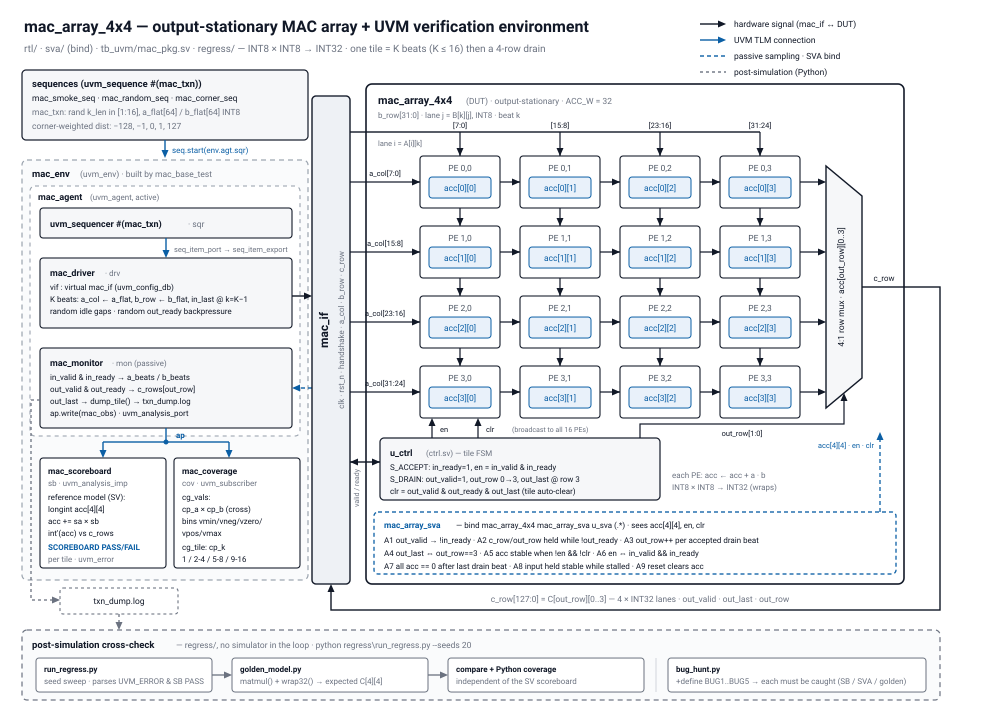

# mac-array-dv

A 4×4 INT8 output-stationary MAC array in SystemVerilog (parameterized N×N, default N = 4, also regressed at 8×8), verified with a from-scratch UVM 1.2 environment — constrained-random stimulus, reference-model scoreboard, SVA, functional coverage, and Python-driven regression.

## Motivation

This project grew out of a computer architecture course where I implemented a 5-stage pipelined MIPS processor. What hooked me wasn't the design itself, but the quantitative side: measuring how hazards change execution time across instruction streams, and how cache configurations shift hit/miss behavior. I wanted to keep going in that direction, but as an exchange-bound student I couldn't commit to a multi-semester lab internship. After consulting with over ten professors on what a single semester could realistically produce, the consistent advice was: build one complete, self-contained artifact.

So the design (DUT) is deliberately small — the point is the verification infrastructure on top of it. Roughly 60% of the effort goes into the UVM environment: verification planning, constrained-random sequences, a scoreboard against a Python golden model, assertions, coverage closure, and seed-swept regression. Design verification is, at its core, the same thing I enjoyed in that course — quantitatively confirming how a system behaves.

## Repository layout

```
mac-array-dv/
├── rtl/           # mac_pe.sv, ctrl.sv, mac_array_4x4.sv, mac_if.sv  (~140 lines total)
├── tb_uvm/        # agent, driver, monitor, scoreboard, sequences, env, test
├── sva/           # protocol / data-integrity assertions
├── regress/       # Python regression scripts + seed management + summaries
├── synth/         # Yosys generic synthesis script (python synth/run_synth.py)
├── docs/
│   ├── verification_plan.md   # feature → coverage → assertion mapping
│   ├── cmos_background.md     # CMOS gate background → what a MAC PE synthesizes to (Korean)
│   ├── synth_report.md        # Yosys cell counts: multiplier vs adder vs flops
│   ├── coverage_report/       # screenshots + numbers
│   └── bug_log.md             # bug reports (incl. injected-bug hunt)
└── README.md
```

## Toolchain

- Vivado 2020.2 `xsim` (UVM 1.2 built in — no extra installs), simulation only
- Python 3 for the golden model and regression driver
- Yosys 0.69 (`pip install yowasp-yosys`) for generic gate-count synthesis — [synth_report.md](docs/synth_report.md)
- CI (GitHub Actions): Verilator lint of `rtl/` clean **and with each injected-bug hook**,
  plus 65 pytest cases over the golden model — the checks that need no simulator licence

## Status

- [x] W1 — repo bootstrap, verification plan skeleton, SV toy + "Hello UVM" pass on xsim
- [x] W2 — `mac_pe.sv` + directed self-checking TB: 36 sign/boundary corners + 1000 randoms, 1073 checks PASS
- [x] W3 — 4×4 array + control FSM: 50 golden-model tiles PASS (**M0**)
- [x] Phase 1 — valid/ready protocol + **9 SVA** bound into the DUT; injected-bug assertion violation captured (**M1**, `docs/coverage_report/m1_sva_violation.txt`)
- [x] Phase 2 — UVM 1.2 env from scratch: agent (sequencer/driver/monitor), reference-model scoreboard, constrained-random with corner-weighted `dist`, smoke/random/corner tests (**M2**)
- [x] Phase 3 — functional coverage (native covergroups **and** Python bin-counting), 20-seed Python regression, injected-bug hunt (**M3**, `docs/bug_log.md`)
- [ ] Phase 4 — final packaging

## Results

| Metric | Value |
|---|---|
| Regression | **57/57 runs PASS** — smoke + corner + 5 reset seeds (4 mid-ACCEPT/mid-DRAIN resets each) + 50 random seeds × 20 tiles; **1099 tiles** cross-checked against the Python golden model, 0 mismatches, 0 SVA violations ([summary.md](regress/results/summary.md)) |
| Functional coverage | **25/25 Python bins (100%)** aggregated across the sweep; SV `cg_vals` reaches 100% per run, `cg_tile` closes across the suite (K = 64 comes from the directed corner tiles, not from any single random run) |
| Assertions | 12 SVA — protocol, state, reset (acc + FSM + row), and **datapath** checks that recompute the accumulator from the spec; A1/A5/A6 written against interface intent, each proven by an injected bug; 0 violations on clean RTL |
| Stimulus distribution | Random-test K shares **48.4 / 22.1 / 16.7 / 12.8 %** vs target 50 / 25 / 15 / 10 over 1000 tiles, checked by the regression itself — xsim was silently sampling K uniformly while coverage read 100 % ([bug_log.md](docs/bug_log.md#k-distribution-ignored--stimulus-looked-random-but-not-with-the-intended-weights)) |
| Golden-model cross-checks | 3 independent layers: SVA / SV scoreboard / Python post-sim recompute |
| Injected-bug hunt | **8/8 caught** by SVA (BUG1–5 + BUG6–8 added to prove the rewritten assertions); scoreboard also catches 7/8 — BUG8 is functionally masked ([bug_log.md](docs/bug_log.md)) |
| 8×8 build | `MAC_N=8 python regress/run_regress.py --seeds 20` → **27/27 runs PASS**, 499 tiles cross-checked, 0 mismatches, 25/25 bins ([summary_n8.md](regress/results/summary_n8.md)); BUG2/BUG3/BUG7 still caught by SVA at N = 8 |
| Synthesis (generic Yosys, no ABC/liberty) | PE: 8×8 multiplier 456 cells vs 32b adder 220 (~2.1×); 4×4 array 16242 logic cells + 515 flops ([synth_report.md](docs/synth_report.md)) |
| Verification plan | 9 features → 2 SV covergroups (+25 Python bins) → 12 assertions ([verification_plan.md](docs/verification_plan.md)) |
| Known gaps | Documented, not hidden — see [verification_plan.md §6](docs/verification_plan.md). An audit of this environment found assertion A8 passing **vacuously**; the driver was reworked so the stall it checks actually occurs, and the monitor now fails the test if it doesn't. |

### Future work

- AXI-Stream wrapper around the valid/ready ports, with an AXI-Stream UVM agent
- FPGA bring-up (Vivado synthesis/implementation + on-board test)
- Liberty-mapped area/timing with an open PDK (needs a Yosys build with working ABC)
- E7: the `ACC_W` parameter is still inert (`c_row` lanes, SVA and scoreboard assume 32)

### Architecture



### Three-layer checking

```
constrained-random sequences ──> driver ──> DUT (4×4 MAC array) <── 9 SVA (bind, sees acc/en/clr)
                                              │
                                 monitor (posedge sampling)
                                   ├──> scoreboard: SV reference model (in-sim)
                                   ├──> covergroups: values × sign cross, K bins
                                   └──> txn dump ──> Python golden model cross-check + coverage bins (post-sim)
```

### xsim 2020.2 quirks discovered (documented in the verification plan)

`default disable iff` and `$past/$stable` unsupported in properties → per-property disable + hand-rolled sample registers; UVM lib needs `xelab -timescale`; `-testplusarg` quoting on Windows.
